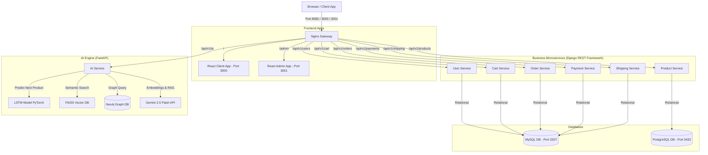

# Hệ Thống E-Commerce Microservices Tích Hợp Trí Tuệ Nhân Tạo (EcomAI)

Chào mừng bạn đến với **EcomAI** — Hệ thống thương mại điện tử hoàn chỉnh được thiết kế theo kiến trúc **Microservices & Domain-Driven Design (DDD)**, kết hợp **Hệ thống gợi ý lai (Hybrid Recommendation)** và **Trợ lý mua sắm RAG Chatbot**. 

Dự án này được xây dựng từ số không (from zero), đóng gói khép kín hoàn toàn qua **Docker Compose** phục vụ cho tiểu luận môn học **Kiến trúc và Thiết kế Phần mềm**.

---

## 📐 Kiến Trúc Hệ Thống (System Architecture)

Hệ thống bao gồm **10 container** được điều phối qua một **Nginx Gateway** đóng vai trò Reverse Proxy điều hướng duy nhất.



---

## 🛠️ Công Nghệ Sử Dụng (Technology Stack)

| Thành phần | Công nghệ / Thư viện chính | Vai trò | CSDL / Lưu trữ |
| :--- | :--- | :--- | :--- |
| **Gateway** | Nginx | Reverse Proxy & API Gateway điều phối | - |
| **User Service** | Django REST Framework, SimpleJWT | Quản lý người dùng, hồ sơ, xác thực JWT | MySQL (`user_db`) |
| **Product Service** | Django REST Framework, Django ORM | Quản lý danh mục, sản phẩm, tồn kho | PostgreSQL (`product_db`) |
| **Cart Service** | Django REST Framework | Quản lý giỏ hàng & sản phẩm đã chọn | MySQL (`cart_db`) |
| **Order Service** | Django REST Framework | Tạo đơn hàng, kiểm tra tồn kho, quản lý trạng thái | MySQL (`order_db`) |
| **Payment Service** | Django REST Framework | Xử lý thanh toán giả lập và ghi nhận hóa đơn | MySQL (`payment_db`) |
| **Shipping Service** | Django REST Framework | Tạo vận đơn, quản lý hành trình vận chuyển | MySQL (`shipping_db`) |
| **AI Service** | FastAPI, PyTorch, FAISS, Neo4j Driver | Tính toán gợi ý lai, quản lý chatbot RAG | SQLite (`ai_logs.db`) |
| **Frontend Client** | ReactJS, Vite, Tailwind CSS, Outfit Font | Trang mua sắm, hiển thị gợi ý, Widget Chatbot | LocalStorage |
| **Frontend Admin** | ReactJS, Vite, Tailwind CSS, Outfit Font | Trang quản trị, quản lý kho, duyệt đơn, phân quyền | LocalStorage |

---

## 🔌 Cổng Dịch Vụ Mặc Định (Port Mapping)

Khi hệ thống khởi chạy, các cổng sau sẽ được ánh xạ ra máy chủ vật lý (Host):

* **Nginx Gateway (Điểm truy cập chung)**: `http://localhost:8082`
* **Giao diện Khách hàng (User Store)**: `http://localhost:3000`
* **Giao diện Quản trị viên (Admin Dashboard)**: `http://localhost:3001`
* **CSDL PostgreSQL (Product Catalog)**: `http://localhost:5432` (User: `ecom_user`, Pass: `ecom_password`)
* **CSDL MySQL (Chứa các DB nghiệp vụ)**: `http://localhost:3307` (Root pass: `root_password`)
* **CSDL Đồ thị Neo4j (AI Graph Browser)**: `http://localhost:7474` (User: `neo4j`, Pass: `password`)
* **Neo4j Bolt Protocol (Kết nối Driver)**: `http://localhost:7687`

---

## 🤖 Cơ Chế Hoạt Động Của AI Service

AI Service trong hệ thống EcomAI giải quyết 2 bài toán lớn:

### 1. Trợ lý mua sắm AI (RAG Chatbot)
* **Quy trình xử lý**:
  1. Người dùng nhập câu hỏi (ví dụ: *"Tôi muốn mua một đôi giày để chạy bộ"*).
  2. AI Service sử dụng **Gemini API** để chuyển câu hỏi thành vector đại diện (embedding).
  3. Tìm kiếm vector có độ tương đồng cao nhất trên **FAISS Vector Database** chứa thông tin 22 sản phẩm hiện có trong kho.
  4. Lấy danh sách các sản phẩm khớp nhất làm ngữ cảnh (Context) rồi kết hợp với câu hỏi ban đầu để gửi yêu cầu (Prompt) đến **Gemini 2.5 Flash**.
  5. Mô hình tạo ra phản hồi Tiếng Việt thân thiện, cấu trúc danh sách rõ ràng, kèm thông tin mã sản phẩm chính xác.

### 2. Gợi ý cá nhân hóa (Hybrid Recommendation)
Danh sách gợi ý ở trang chủ được tính toán trực tiếp theo thời gian thực dựa trên 3 thuật toán song song với trọng số:
$$\text{Score} = 0.4 \cdot \text{LSTM} + 0.3 \cdot \text{Graph} + 0.3 \cdot \text{RAG}$$

* **LSTM (Deep Learning - PyTorch)**: Nhận đầu vào là chuỗi 5 hành động xem (`VIEW`) sản phẩm gần nhất của người dùng, dự đoán ID sản phẩm tiếp theo họ có khả năng muốn mua nhất.
* **Graph (Neo4j)**: Truy vấn quan hệ trên đồ thị liên kết thực thể Người dùng - Sản phẩm (Các mối quan hệ `BUY`, `VIEW`, `SIMILAR`). Gợi ý sản phẩm dựa trên hành vi mua sắm tương đương của nhóm khách hàng khác (Collaborative Filtering).
* **RAG (Semantic)**: Tính toán mức độ tương đồng giữa các từ khóa tìm kiếm gần đây của người dùng với các sản phẩm trong kho.

---

## 🚀 Hướng Dẫn Khởi Chạy (Quick Start)

Hệ thống đã được thiết lập để tự động hóa toàn bộ quy trình cấu hình ban đầu (Automated Seeding & Migrations). 

### Bước 1: Thiết lập khóa Gemini API
Tạo tệp `.env` tại thư mục gốc của dự án `ecom-final/` (cùng cấp với `docker-compose.yml`) và điền khóa Gemini API của bạn:
```env
GEMINI_API_KEY=AIzaSy...your-actual-api-key
```
*(Lưu ý: Tệp `.env` đã được cấu hình trong `.gitignore` để tránh bị đẩy lên các kho lưu trữ công cộng).*

### Bước 2: Khởi động hệ thống
Mở Terminal tại thư mục `ecom-final/` và chạy lệnh duy nhất:
```bash
docker compose up -d --build
```

### Bước 3: Đồng bộ chỉ mục Vector FAISS
Sau khi các container khởi động hoàn tất và dữ liệu mẫu đã được nạp tự động, chạy lệnh sau để tạo vector nhúng (embeddings) thực tế cho toàn bộ sản phẩm và đồng bộ vào chỉ mục FAISS:
```bash
docker compose exec product-service python manage.py sync_products
```

---

## 🔑 Tài Khoản Demo Hệ Thống

Ngay sau khi khởi động thành công, cơ sở dữ liệu sẽ chứa sẵn các tài khoản mẫu sau để bạn kiểm thử chức năng:

### 1. Tài khoản khách hàng (Customer)
* **Username**: `customer1` (hoặc `customer2`)
* **Mật khẩu**: `CustomerPassword123!`
* *Chức năng chính*: Xem sản phẩm, đặt hàng, thanh toán COD, kiểm tra hành trình vận chuyển, trò chuyện với Trợ lý AI, nhận gợi ý sản phẩm cá nhân hóa.

### 2. Tài khoản quản trị viên (Admin)
* **Username**: `admin`
* **Mật khẩu**: `AdminPassword123!`
* *Chức năng chính*: Quản lý danh mục & sản phẩm (thêm, sửa, tìm kiếm sản phẩm), tải lên hình ảnh sản phẩm, quản lý phân quyền thành viên, quản lý danh sách đơn hàng và cập nhật hành trình vận chuyển (vận đơn).

---

## 📂 Danh Mục Sản Phẩm Mẫu (Seeded Catalog)

Hệ thống khởi tạo sẵn **22 sản phẩm** thuộc 3 ngành hàng chính:
1. **Sách (Book)**: Sách công nghệ, lập trình Python, thiết kế Microservices, kiến trúc phần mềm, v.v.
2. **Đồ điện tử (Electronics)**: Điện thoại iPhone 15, tai nghe Sony, MacBook, bàn phím cơ Keychron, loa Bluetooth JBL, chuột không dây Logitech.
3. **Thời trang (Fashion)**: Áo khoác Uniqlo, giày thể thao Adidas, áo thun Polo, balo du lịch.

---

## 📈 Quy Trình Huấn Luyện Lại & Cập Nhật Model LSTM (LSTM Model Retraining)

Khi bạn thực hiện huấn luyện lại mô hình LSTM dự đoán chuỗi hành vi mua sắm (ví dụ: thông qua Jupyter Notebook `train_lstm.ipynb` trong thư mục `ai-service`), hãy thực hiện các bước sau để áp dụng tệp trọng số mới vào container đang chạy:

1. **Sao chép tệp trọng số mới từ máy host vào Docker container**:
   Do thư mục `data` của `ai-service` được đồng bộ qua Named Volume của Docker, tệp trọng số mới lưu trên local không tự động nạp vào container. Hãy chạy lệnh sau từ thư mục gốc của dự án:
   ```bash
   docker cp ai-service/data/lstm_weights.pth ai-service:/app/data/lstm_weights.pth
   ```
2. **Khởi động lại dịch vụ AI Service để nạp lại mô hình**:
   Mô hình được tải trực tiếp vào bộ nhớ RAM khi khởi chạy ứng dụng FastAPI. Hãy khởi động lại container để cập nhật các trọng số mới vào bộ nhớ:
   ```bash
   docker compose restart ai-service
   ```
3. **Kiểm tra nhật ký khởi động để xác nhận**:
   Theo dõi log của dịch vụ để đảm bảo mô hình mới đã nạp thành công:
   ```bash
   docker compose logs -f ai-service
   ```
   Nếu thành công, bạn sẽ thấy thông báo: `Loaded LSTM model weights successfully.`

---

## 🛠️ Quản Trị Hệ Thống & Khắc Phục Sự Cố (Troubleshooting)

### 1. Xem nhật ký hoạt động (Logs)
Để kiểm tra hoạt động hoặc gỡ lỗi các microservices cụ thể:
```bash
docker compose logs -f [tên_dịch_vụ]
# Ví dụ:
docker compose logs -f ai-service
docker compose logs -f product-service
```

### 2. Làm sạch hoàn toàn và khởi động lại từ đầu
Nếu bạn muốn reset toàn bộ các database về trạng thái rỗng và seed lại từ đầu:
```bash
# Dừng hệ thống và xóa toàn bộ dữ liệu ổ đĩa docker
docker compose down -v

# Khởi động lại
docker compose up -d --build

# Chờ 15s cho database sẵn sàng, sau đó đồng bộ lại Vector DB
docker compose exec product-service python manage.py sync_products
```

---
**© 2026 E-Commerce AI System.** Dự án mã nguồn mở phục vụ học tập nghiên cứu.